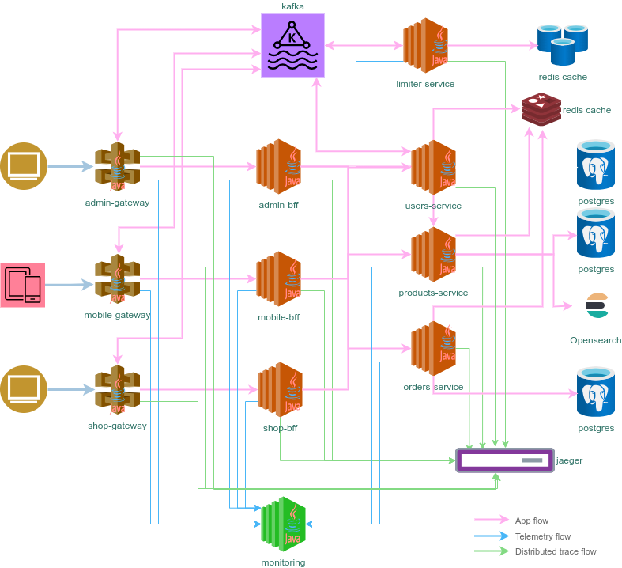

# Spring Admin Server

[](https://github.com/sjexpos/ecomm-monitoring/releases/latest)
[](https://github.com/sjexpos/ecomm-monitoring/actions?workflow=CI)
[](https://codecov.io/gh/sjexpos/ecomm-monitoring)
[](https://github.com/sjexpos/ecomm-monitoring/issues)
[](https://github.com/sjexpos/ecomm-monitoring/commits)

[](https://hub.docker.com/r/sjexposecomm/monitoring)
[](https://hub.docker.com/r/sjexposecomm/monitoring/tags)



This microservice is responsible for ...

## Framework

* [Spring Boot 3.3.2](https://spring.io/projects/spring-boot/)
* [Spring Cloud 2023.0.3](https://spring.io/projects/spring-cloud)
* [Spring Admin 3.3.3](https://github.com/codecentric/spring-boot-admin)

## Requirements

* [Java 21](https://openjdk.org/install/)
* [Maven 3.8.8+](https://maven.apache.org/download.cgi)
* [AWS Cli](https://aws.amazon.com/es/cli/)
* [Docker](https://www.docker.com/)

## Build

```bash
mvn clean && mvn install
```

## Run Tests
```bash
mvn clean && mvn tests
```

### Run application
```bash
./run.sh
```

## Swagger UI

http://localhost:9090/

